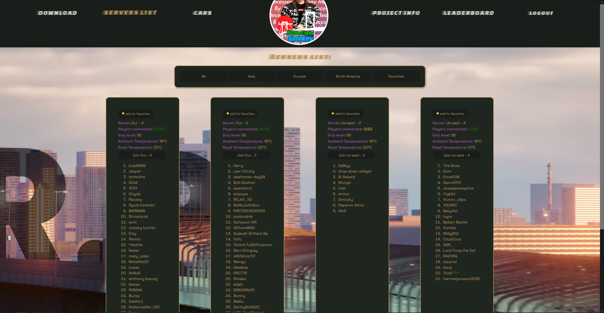

# Concordia Bootcamp final project April 2023.

## Website for srp.


<p>
  This is a website I have made for the Shutoko Revival Project, a popular mod for the racing simulator Assetto Corsa. This project was required to be made on the MERN stack with CRUD and using only styled components as styling library.
</p>
The features are:
<ul>
  <li>🏅 Time attack leaderboard with pagination and data from SRP's leaderboard api 🏅</li>
  <li>📑 Detailed list of their servers from their servers apis 📑</li>
  <li>🕴 Users can login and favorite the servers they use the most for quicker access 🕴</li>
  <li>⏬ Download page to get all of the mod's content ⏬</li>
  <li>🚘 A page detailing the cars included in the car pack. 🚘</li>
  <li>📃 Srp information page. 📃</li>
  <li>📲 Responsive design 📲</li>
</ul>

To run, open a terminal and write the commands ```cd client```, ```yarn install ``` and ```yarn start```.
Open a second terminal and write the commands ```cd server```,  ```yarn install ``` and ```yarn start```

<iframe width="560" height="315" src="https://www.youtube.com/embed/VKlrg3rCXeQ" title="YouTube video player" frameborder="0" allow="accelerometer; autoplay; clipboard-write; encrypted-media; gyroscope; picture-in-picture; web-share" allowfullscreen></iframe>


### Cars page

### Servers page


### Leaderboard page

### Responsive